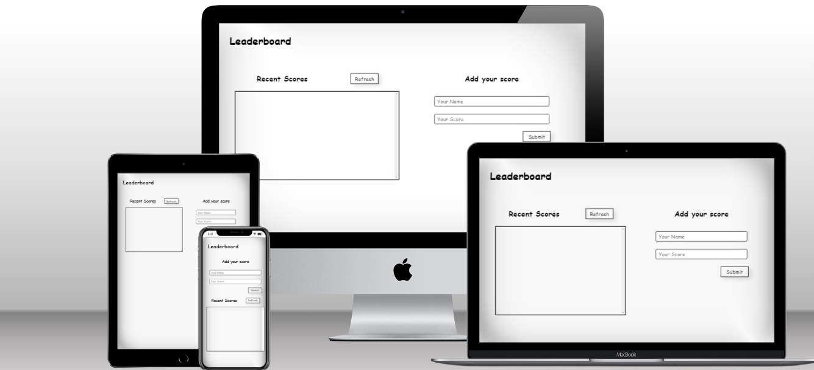

# Leaderboard

> ### The leaderboard website displays scores submitted by different players. It also allows you to submit your score. All data is preserved thanks to the external Leaderboard API service. Build with Html, CSS, JS, API, and Webpack.

## Built With

- [x] Languages: HTML, Sass and JavaScript
- [x] Linters: Lighthouse, Webhint, Stylelint and ESLint
- [x] Module Bundler: Webpack
- [x] Module Bundler Loaders: Style, CSS and Sass
- [x] Code Editor: VS Code

## Website Mockup 📱 💻 🖥️


## Live Demo

Check the live demo[Leaderboard app link](https://elijahdre.github.io/Leaderboard/dist/)👈


## Getting Started

To get a local copy up and running follow these simple steps.

### Prerequisites

- [x] A web browser like Google Chrome.
- [x] A code editor like Visual Studio Code with Git and Node.js.

You can check if Git is installed by running the following command in the terminal.
```
$ git --version
```

Likewise for Node.js and npm for package installation.
```
$ node --version && npm --version
```

### Setup

Clone the repository using the GitHub link provided below.

### Install

In the terminal, go to your file directory and run this command.

```
$ git clone git@github.com:elijahdre/leaderboard.git
```

### Usage

Kindly modify the files as needed.

### Run tests

To check for linters, use the files provided by [Microverse](https://github.com/microverseinc/linters-config). A GitHub action is also set to run during pull request.
```
$ npm install
```

### Deployment

This app is deployed in the GitHub Pages for easy viewing upon merged on the main branch.
Please find the link in the Live Demo section.


## Author

👤 **Elijah Odjegba**

- GitHub: [](https://github.com/elijahdre)
- Twitter: [](https://twitter.com/elijahdre)
- LinkedIn: [](https://www.linkedin.com/in/elijah-odjegba-862708179/)


## 🤝 Contributing

Contributions, issues, and feature requests are welcome!

Feel free to check the [issues page](https://github.com/Elijahdre/Leaderboard/issues).

## Show your support

Give a ⭐️ if you like this project!

## Acknowledgments

- [Microverse](https://www.microverse.org/)
- Code Reviewers

## 📝 License

This project is [MIT](./MIT.md) licensed.
